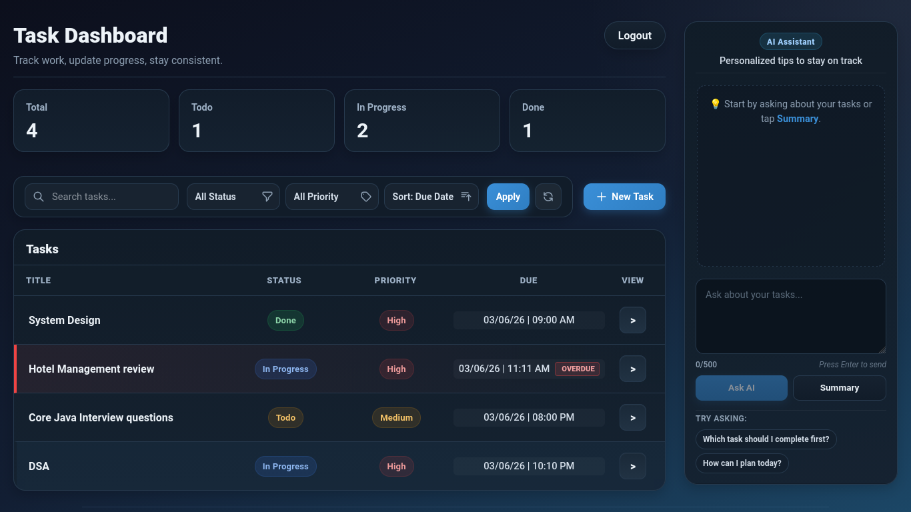
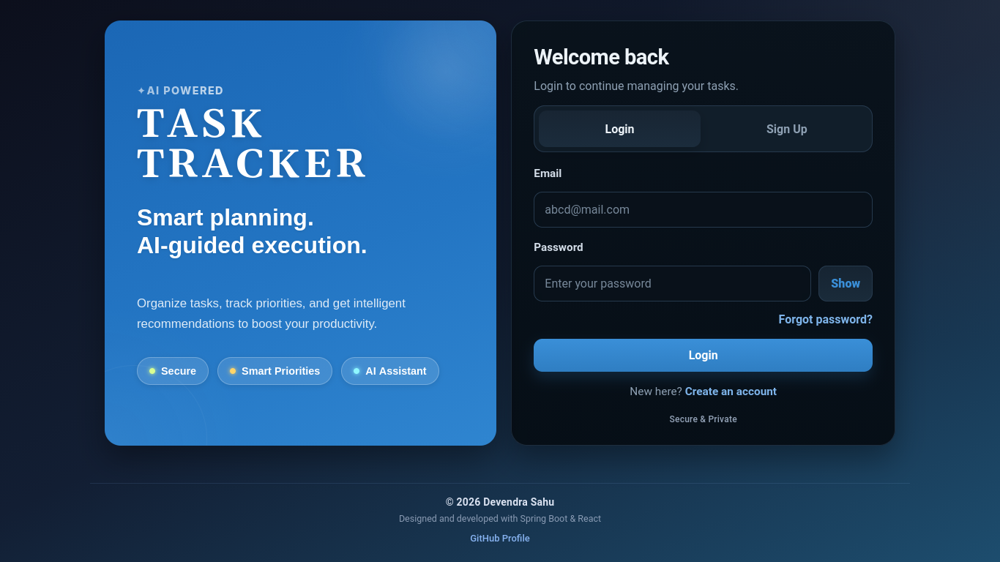
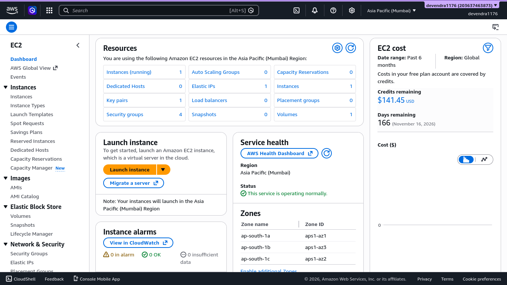
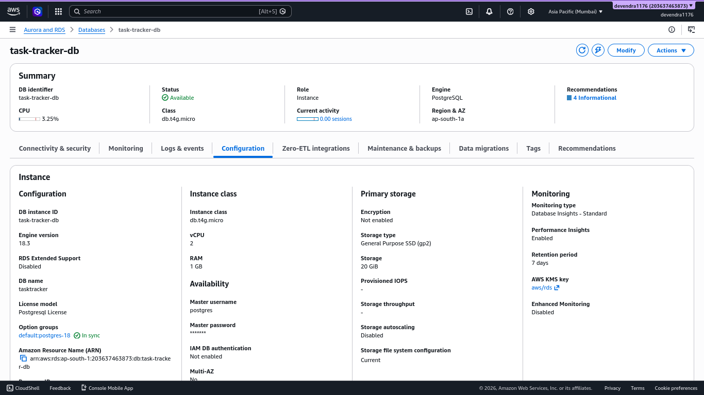

# Task Tracker API

### Production-Ready Spring Boot Backend for AI-Powered Task Management

## Production Infrastructure

- AWS EC2 (Application Hosting)
- Amazon RDS PostgreSQL (Managed Database)
- GitHub Actions (CI/CD Automation)
- Nginx (Reverse Proxy)
- Let's Encrypt + Certbot (HTTPS)
- Custom Domain Routing
- systemd Service Management

The system provides secure user authentication, user-specific task management, overdue task detection, and an AI-powered
productivity assistant that analyzes task data to generate personalized insights and recommendations.

The project showcases modern backend engineering practices including API security, AWS cloud deployment, PostgreSQL
database design, AI integration, and automated CI/CD workflows.

> This repository contains the **backend API**. The frontend is maintained in a separate repository and deployed
> independently.
---

## Live Application

**Frontend:**
https://tasktracker.app.devendra.indevs.in

**Backend API:**
https://tasktracker.api.devendra.indevs.in
---

## Why This Project?

Task Tracker API was built to explore how modern backend systems combine security, cloud infrastructure, AI
capabilities, and deployment automation into a production-ready application.

The project focuses on:

- Secure API design
- User-specific data isolation
- Cloud deployment on AWS
- AI-powered productivity workflows
- CI/CD automation

## Engineering Highlights

- AWS EC2 (Linux/UNIX) deployment
- Amazon RDS PostgreSQL database
- GitHub Actions based CI/CD pipeline
- HTTPS with Custom Domain
- Nginx Reverse Proxy
- AI-powered task summary and task guidance
- Exact due-date and due-time tracking
- Overdue task detection and visual highlighting
- Search, filter, sorting, and pagination
- Global exception handling
- Request validation
- Structured API response format
- Logging for important actions and errors
- JWT-based authentication and authorization
- User-specific task ownership
- DTO-based clean API design
- Production Service Management (systemd)

---

## Screenshots

### Dashboard:



### AI Assistant:


<details>
<summary> View generated content of AI Assistant: </summary>

Summary07:18 pm

✅ Celebrating your win: System Design task is marked complete! Great work pushing through that high-priority goal. 🎉

⏰ Urgent focus needed:  
Core Java Interview questions (Due in 41minutes) – This is your top priority. Time is critical!  
Hotel Management review (Overdue by 8h7m) – Needs immediate action to get back on track.  
DSA (Due in 2h51m) – Tackle the hardest recursion problem first to save mental energy later.

💡 Next steps:  
For Core Java: Use the "Break into steps" technique. Pick 1-2 key topics (e.g., OOPs concepts or collections) to revise
in 15 minutes.  
For Hotel Management: Apply the Feynman Technique. Explain one core project feature aloud as if teaching a beginner—this
will reveal gaps to fix.

⏰ Next up: Core Java Interview questions (Due in 41minutes)  
Need help planning? Just ask! 💬

"The best time to plant a tree was 20 years ago. The second-best time is now." 🌱

---

You07:20 pm

How can I plan today?
✨ AI07:20 pm

Let's build a tight action plan for today's urgent tasks! 🕒🎯
Core Java Interview Prep (DUE IN 39 MINUTES)  
🎯 Focus: Quick fire mode  
5 mins: Review Java OOPs concepts (inheritance/poly)  
10 mins: Code 2 core problems (StringBuilder/Exceptions)  
10 mins: Flashcards for collection framework  
15 mins: Mock interview with a friend or recording  
DSA Recursion (DUE IN 2H49M)  
🧠 Use "Eat the Frog" technique:  
5 mins: Write base case for 3 recursion problems  
10 mins: Dry run 1 complex recursive function  
10 mins: Convert iterative code to recursive  
Overdue Tasks (Prioritize 30 mins each)  
🔧 System Design:  
Break into 3 micro-tasks (e.g., 10 mins on API design, 10 mins on DB schema)

🏨 Hotel Management:  
Try the Feynman method: Explain project flow to a rubber duck for 15 mins

Time Blocking Suggestion  
07:25 PM - 08:05 PM: Core Java ⏰  
08:05 PM - 08:35 PM: DSA Frog Attack 🐸  
08:35 PM - 09:05 PM: System Design Fix  
09:05 PM - 09:35 PM: Hotel Project Simplify

Need help breaking down any task into 15-min chunks? Want practice questions for Java? Just say! 💬✨

P.S. The app's timer shows System Design task is 10h20m overdue. You can adjust deadlines in the app settings if needed.
🛠️
---
</details>

### Authentication (Front Page):



### AWS EC2 Infrastructure



### Amazon RDS PostgreSQL



---

## Tech Stack

### Backend

- Java 21
- Spring Boot 3
- Spring Security
- Spring Data JPA
- Spring Validation
- Spring AI
- Maven

### Database

- PostgreSQL
- Amazon RDS

### Cloud & DevOps

- AWS EC2
- Nginx reverse proxy
- systemd service management
- Let's Encrypt SSL
- Certbot
- GitHub Actions

### AI

- Spring AI
- Groq-powered AI integration

---

## Architecture

```text
Client / Frontend
        │
        ▼
JWT Bearer Token
        │
        ▼
Spring Security Filter Chain
        │
        ▼
REST Controllers
        │
        ▼
Service Layer
      ├────────► Spring AI
      │
      ▼
Repository Layer
        │
        ▼
Amazon RDS PostgreSQL
```

The service layer coordinates both business logic and AI-powered productivity workflows.

This backend uses a layered architecture and keeps business rules in the service layer, data access in repositories, and
request handling in controllers.

---

## Authentication Flow

1. User signs up with username, email, and password.
2. Password is encrypted before storage.
3. User logs in with email and password.
4. Backend returns a JWT token.
5. Frontend sends the token in the `Authorization: Bearer <token>` header.
6. Protected endpoints validate the token before allowing access.

---

## Core Features

### Authentication and Security

- Signup and login APIs
- JWT authentication
- BCrypt password encryption
- Protected task and AI APIs
- User-based authorization
- Secure authentication error handling

### Task Management

- Create tasks
- Update tasks
- Delete tasks
- Partial task status updates
- Due date and due time support
- Per-user task isolation
- Deadline-aware task ordering

### Productivity Features

- Overdue task detection
- Overdue highlighting
- Exact due-time awareness
- Priority-based task handling
- Smart deadline-focused dashboard behavior

### Search and Organization

- Search tasks by title and description
- Filter by status
- Filter by priority
- Pagination
- Sorting

### API Quality

- DTO-driven request and response models
- Validation using bean validation
- Global exception handling
- Standard JSON responses
- Logging for auth, task, AI, and error flows

---

## AI Features

The platform integrates Spring AI to provide a personalized productivity assistant.

The assistant works with the authenticated user's task data and can:

- Analyze active tasks
- Detect overdue work
- Generate workload summaries
- Suggest task priorities
- Provide deadline-aware productivity guidance
- Answer natural-language questions about tasks

### AI Endpoints

- `GET /ai/tasks/summary`
- `POST /ai/tasks/ask`

The AI service uses the current authenticated user, reads that user’s tasks, and generates context-aware responses.

---

## API Overview

### Auth

- `POST /auth/signup`
- `POST /auth/login`

### Tasks

- `POST /tasks`
- `GET /tasks`
- `GET /tasks/{id}`
- `PUT /tasks/{id}`
- `PATCH /tasks/{id}/status`
- `DELETE /tasks/{id}`

### Search / Filter / Pagination

- `GET /tasks/search`
- `GET /tasks/filter`
- `GET /tasks?page=0&size=10&sortBy=dueDateTime&direction=desc`

### AI

- `GET /ai/tasks/summary`
- `POST /ai/tasks/ask`

---

## Cloud Infrastructure

### Backend Deployment

- Spring Boot backend runs on **AWS EC2** in the **Mumbai (ap-south-1)** region.
- The app is managed by **systemd** so it can auto-start and auto-restart.
- **Nginx** is used as a reverse proxy.
- HTTPS is enabled with **Let's Encrypt** and **Certbot**.
- The backend is exposed through a custom domain.

### Database Deployment

- PostgreSQL is hosted on **Amazon RDS**.
- The application connects to the database over the AWS network using secure credentials.

### Frontend Deployment

- The frontend is hosted separately on **Vercel**.
- A custom domain is used for the live UI.

---

## CI/CD Pipeline

This backend uses **GitHub Actions** for automated deployment.

### Pipeline Flow

1. Code is pushed to the `main` branch.
2. GitHub Actions triggers automatically.
3. Java 21 is set up.
4. Maven builds the project.
5. The workflow connects to AWS EC2 through SSH.
6. The backend service is restarted with `systemd`.
7. A health check verifies the deployment.
8. Backup and rollback mechanisms are included in the deployment workflow.

```
        Developer Push
            ↓
        GitHub Actions
            ↓
        Maven Build
            ↓
        SSH Deployment
            ↓
        AWS EC2
            ↓
        systemd Service Restart
            ↓
        Health Verification
```

### CI/CD Tools

- GitHub Actions
- SSH deployment to EC2
- Maven build automation
- systemd service restart
- Spring Boot Actuator health checks

---

## Security Notes

- Passwords are never stored in plain text.
- JWT is used for stateless authentication.
- Endpoints are protected by Spring Security.
- Task access is limited to the logged-in owner.
- Validation prevents invalid requests from entering the system.
- Global exception handling keeps responses clean and safe.
- CORS is configured for the approved frontend origins.
- User ownership is enforced throughout the data access layer to prevent cross-user data access.

---

## Related Frontend

Frontend Repository:
https://github.com/devendra1176/task-tracker-frontend

Built with React and Vite.

---

## Local Setup

### Requirements

- Java 21
- Maven
- PostgreSQL

### Clone the repository

```bash
git clone https://github.com/devendra1176/task-tracker-api.git
cd task-tracker-api
```

### Configure application properties

Set your local database and AI credentials in `application.properties` or `application-local.properties`.

Example:

```properties
spring.datasource.url=jdbc:postgresql://localhost:5432/tasktracker
spring.datasource.username=your_username
spring.datasource.password=your_password
app.jwt.secret=your_jwt_secret_here
app.cors.allowed-origins=http://localhost:5173,https://tasktracker.app.devendra.indevs.in
```

### Run the application

```bash
./mvnw spring-boot:run
```

If the Maven wrapper is unavailable, use:

```bash
mvn spring-boot:run
```

### Open the API

```text
http://localhost:8080
```

---

## Future Improvements

- Refresh token support
- Automated unit and integration tests
- Notification and reminder system
- Docker-based deployment option
- Monitoring and observability improvements
- Additional AI productivity workflows
- Role-Based Access Control (RBAC)

---

## Author

**Devendra Sahu**

Java Backend Developer | Spring Boot | REST APIs | JWT | PostgreSQL | AWS | AI

---

## Project Goal

This project was built to demonstrate real-world backend development concepts including:

- Secure authentication and authorization
- User-specific data access control
- Clean layered architecture
- Scalable API design
- AI-assisted productivity features
- Cloud deployment on AWS
- Automated CI/CD with GitHub Actions


